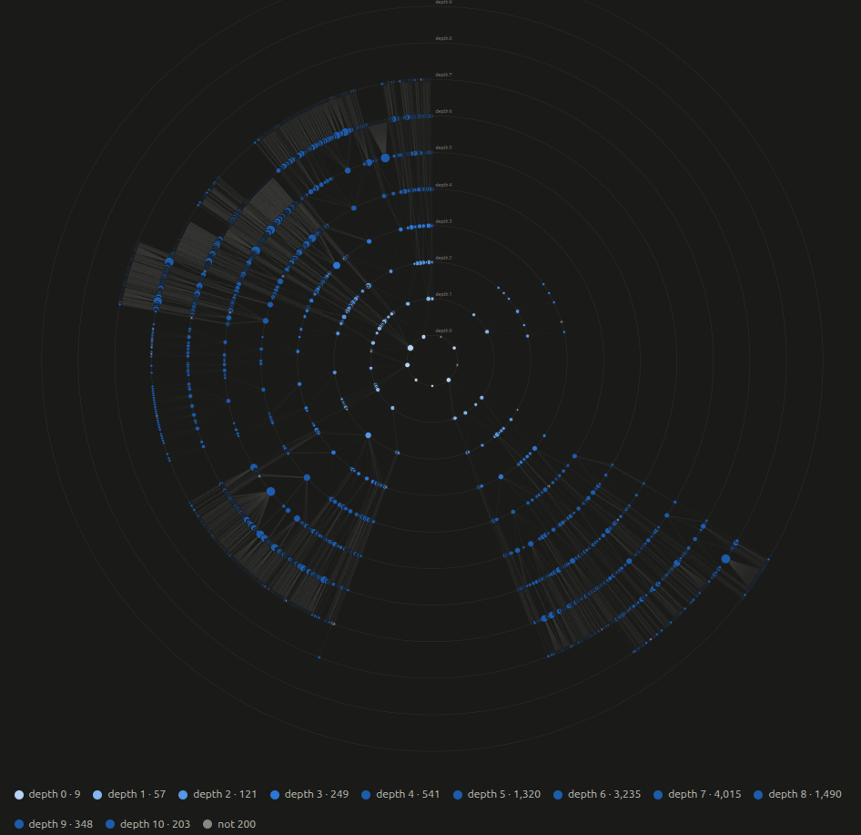
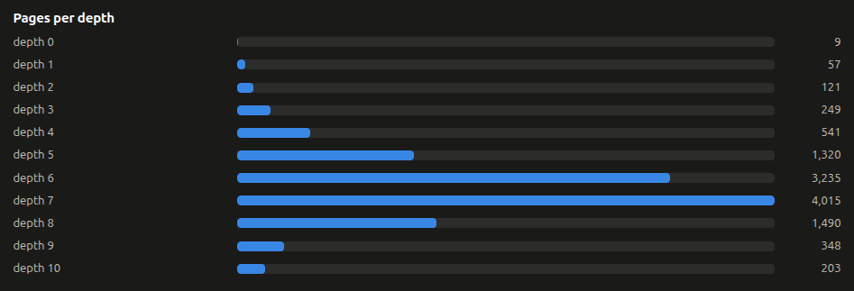
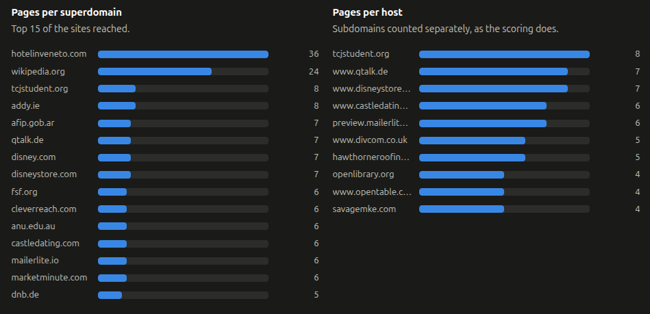
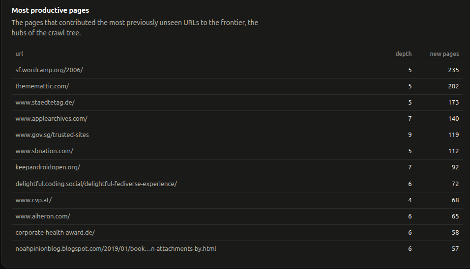

# CS-GY6913-BFS-Crawler

Coursework for CS-GY 6913 Web Search Engines (NYU, Fall 2026).

This is a multithreaded web crawler written in Python. It seeds itself from search engine results (or a seed file) and crawls breadth-first, preferring hosts and domains it has visited least so the crawl spreads across the web. A single scheduler thread owns the frontier, seen set and counters, while a pool of fetcher threads download pages, check robots.txt and extract links. It enforces a per-host and per-domain delay between requests, caps URL length and path depth to avoid spider traps, and writes one log line per fetched page. The design, priority function, known limitations and results are explained in detail in [ps1/explain.txt](ps1/explain.txt).

## Structure

```
.
├── assets/                 images used in this README
└── ps1/                    Assignment 1: a BFS web crawler
    ├── crawler.py          the crawler and its command line
    ├── profile_crawl.py    runs a crawl at several thread counts and reports timing
    ├── seeds.txt           fallback seed URLs
    ├── requirements.txt    pip requirements
    ├── crawl-*.log         sample logs from 1k, 10k and 20k page runs
    ├── readme.txt          how to install and run
    └── explain.txt         how the crawler works
```

See [ps1/readme.txt](ps1/readme.txt) to run the crawler.

## Findings

### Crawl tree



Each ring is one link depth from the seed pages at the center, and each dot is a crawled page drawn next to the page that linked to it. Larger dots discovered more new URLs.

### Pages per depth



This counts how many pages were crawled at each depth. The count peaks at depth 7 and drops after it, because the crawl hit its page limit before it could fully explore the deeper levels.

### Pages per site



The left chart counts pages per registrable domain and the right counts pages per exact host, with subdomains kept separate. Even the top site holds only a small share of the crawl, which shows the priority function spreading requests across many sites.

### Most productive pages



These are the pages that added the most previously unseen URLs to the frontier. They are the hubs of the crawl tree, mostly homepages and link-heavy index pages at middle depths.

## Future scope

The seen set and frontier are plain in-memory Python structures, so memory grows with every URL discovered and everything is lost when the process exits.

- **Bloom filter for the seen set:** answers "have I seen this URL?" in a fixed amount of memory, at the cost of a small, tunable false positive rate (an occasional new URL skipped, never one fetched twice).
- **Redis map for crawl state:** keeps the seen set and counters outside the process, so a crawl can resume after a crash and several crawler machines can share one frontier.
